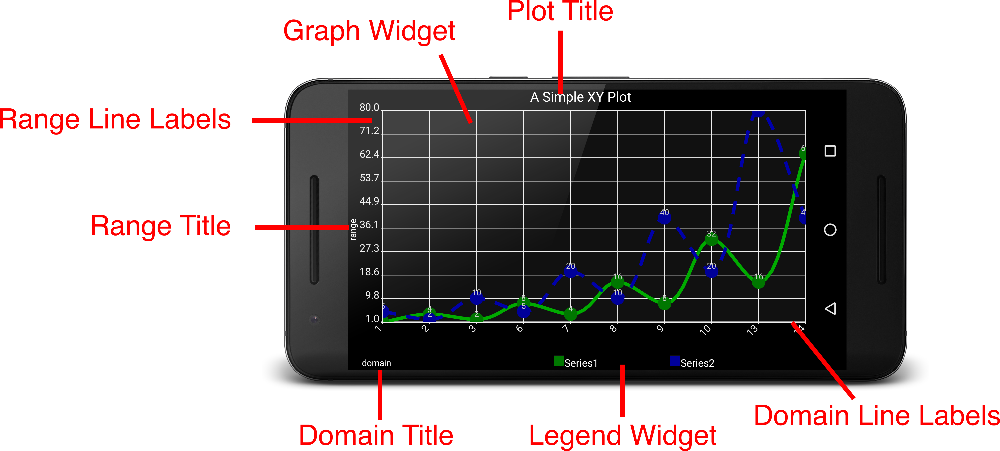

# XYPlot
XYPlot renders XYSeries data onto a graph.

# XYSeries
XYSeries is the interface Androidplot uses to retrieve your numeric data.  You may either create your own
implementation of XYSeries or use SimpleXYSeries if you don't have tight performance requirements or
if your numeric data is easily accessed as an array or list of values.

## SimpleXYSeries
TODO - For now, use the DemoApp's source as a reference as nearly all samples rely on SimpleXYSeries
to populate the graph with series data.

# The Graph
XYGraphWidget encapsulates XYPlot's graphing functionality.  Given an instance of XYPlot, a reference
to XYGraphWidget can be retrieve via `XYPlot.getGraph()`.

## Domain & Range Boundaries
By default, Androidplot will analyze all XYSeries instances registered with the Plot, determine the
min/max values for domain and range and adjust the Plot's boundaries to match those values.  If your
plot contains dynamic data, especially if your plot can periodically contain either no series data
or data with no resolution on one or both axis (all identical values for either x or y) then you may
want to manually set your XYPlot's domain and range boundaries.

To set your plot's boundaries use:

* `XYPlot.setDomainBoundaries(Number value, BoundaryMode mode)`
* `XYPlot.setRangeBoundaries(Number value, BoundaryMode mode)`

Note that the value argument is only used when setting `BoundaryMode.FIXED`.  For all other
modes, pass in null.

### BoundaryMode
Androidplot provides four boundary modes:

#### Fixed
The plot's boundaries on the specified axis are fixed to user defined values.

#### Auto (default)
The plot's boundaries auto adjust to the min/max values for the defined axis.

#### Grow
The plot's boundaries automatically increase to the max value encountered by the plot.  The initial
determines the starting boundaries from which the Grow behavior will be based.

#### Shrink
The plot's boundaries automatically shrink to the min value encountered by the plot.  The initial
determines the starting boundaries from which the Shrink behavior will be based.

## Domain & Range Lines
These are the horizontal lines drawn on a graph.  These lines are configured via:

* `XYPlot.setDomainStep(StepMode mode, Number value)`
* `XYPlot.setRangeStep(StepMode, Number value)`

Androidplot provides these step modes:

### Subdivide
When using `BoundaryMode.SUBDIVIDE`, the graph is subdivided into the specified number of sections.

### IncrementByValue
`BoundaryMode.INCREMENT_BY_VALUE` instructs Androidplot draw grid lines at the specified interval.  This
is the most commonly used modes as is produces an easy to read result.

### IncrementByPixels
`BoundaryMode.INCREMENT_BY_PIXELS` behaves identically to `BoundaryMode.INCREMENT_BY_VALUE` except that 
the increment quantity is expressed in pixels.

## Domain & Range Labels
Androidplot supports labeling domain values on either or both the top and bottom  graph edges 
and range values on either or both the left and right graph edges.  Most default styles show labels
only on the left and bottom edges.

### Dual Axis Labels
Sometimes it is desirable to display additional labels for a single axis, each using it's own scale.

TODO - [f(x) plot example source](../demoapp/src/main/java/com/androidplot/demos/FXPlotExampleActivity.java) 
provides a reference implementation.

### Line Label Interval
Androidplot allows you to configure the interval at which labels are rendered for domain and range lines:

* `XYPlot.getGraph().setLinesPerDomainLabel(int interval)`
* `XYPlot.getGraph().setLinesPerRangeLabel(int interval)`

### Line Label Format
TODO

# Renderers
There are several renderers available for XYPlots:

* LineAndPointRenderer
* BarRenderer
* CandlestickRenderer

# Drawing Smooth Lines
Smooth lines can be created by applying the 
[Catmull-Rom interpolator](http://androidplot.com/smooth-curves-and-androidplot/) to your series' Format.

## The Legend
By default, Androidplot will automatically produce a legend for your Plot.  You however choose to hide the legend
or you can customize it to suit your needs.

TODO